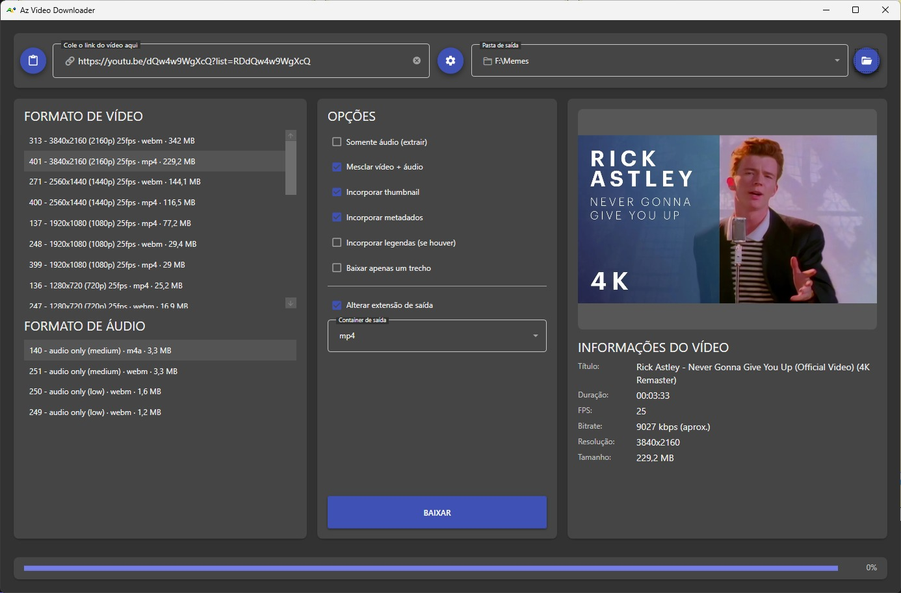
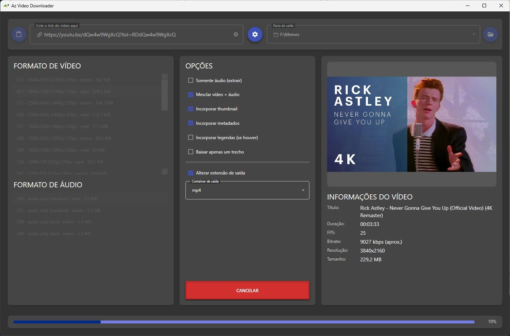

# Az Video Downloader

Um wrapper com interface gráfica para **yt-dlp**, desenvolvido em WPF para facilitar o download de vídeos e áudios sem a necessidade de usar linha de comando.

A ideia não é reinventar o processo de download, mas oferecer uma interface simples para ferramentas que já fazem esse trabalho muito bem.

## Requisitos

* Windows 10 ou superior
* Windows x64
* Conexão com a internet

Não é necessário instalar Python, FFmpeg, yt-dlp ou Deno separadamente ao utilizar a versão distribuída do aplicativo.

## Uso

1. Abra o **Az Video Downloader**.
2. Cole a URL do vídeo no campo superior (ou use o botão de colar).
3. Aguarde o carregamento das informações, da thumbnail e dos formatos disponíveis.
4. Selecione o formato de vídeo e/ou áudio desejado.
5. Marque as opções de processamento:

   * Somente áudio (extrair)
   * Mesclar vídeo + áudio
   * Incorporar thumbnail, metadados e legendas
   * Baixar apenas um trecho
   * Alterar extensão de saída, escolhendo o container
6. Escolha a pasta de saída.
7. Clique em **Baixar** e acompanhe o progresso na barra inferior. Se necessário, clique em **Cancelar**.
8. Ao final, o arquivo processado estará salvo na pasta selecionada.

## Interface

### Vídeo carregado

Após colar a URL, o aplicativo lista os formatos de vídeo e áudio disponíveis, exibe a thumbnail e mostra as informações do conteúdo antes de baixar.



### Download em andamento

Durante o download, a lista de formatos é bloqueada, o botão **Baixar** vira **Cancelar** e a barra de progresso na parte inferior acompanha o andamento em porcentagem.



## Recursos

* Colar a URL com um clique (botão de área de transferência) ou digitando manualmente
* Visualizar informações do vídeo antes do download:

  * Thumbnail
  * Título
  * Duração
  * FPS
  * Bitrate (aproximado)
  * Resolução
  * Tamanho
* Selecionar formatos de vídeo e áudio separadamente, com ID, resolução, FPS, container e tamanho estimado de cada formato
* Mesclar automaticamente vídeo e áudio
* Baixar somente o áudio (extração)
* Baixar apenas um trecho do vídeo
* Converter áudio para:

  * MP3
  * M4A
  * Opus
  * OGG
  * FLAC
  * WAV
  * AAC
* Alterar a extensão de saída, escolhendo o container:

  * MP4
  * MKV
  * MOV
  * WebM
* Incorporar thumbnail ao arquivo final
* Incorporar metadados
* Incorporar legendas (quando disponíveis)
* Escolher a pasta de saída e abri-la diretamente pelo aplicativo
* Acompanhar o progresso do download em tempo real
* Cancelar o download a qualquer momento
* Processamento de mídia através do FFmpeg
* Utilizar o Deno necessário para determinados recursos do yt-dlp

## Como funciona

O Az Video Downloader atua como uma camada gráfica sobre ferramentas de linha de comando já consolidadas:

```text
                    Az Video Downloader
                            │
                            ▼
                       ┌─────────┐
                       │ yt-dlp  │
                       └────┬────┘
                            │
              ┌─────────────┴─────────────┐
              │                           │
        Informações                    Download
        do conteúdo                       │
                                          ▼
                                    ┌──────────┐
                                    │  FFmpeg  │
                                    └────┬─────┘
                                         │
                                         ▼
                                   Arquivo final
```

O aplicativo não realiza diretamente a extração ou conversão dos streams. Essas tarefas são delegadas às ferramentas responsáveis por elas.

## Dependências

O aplicativo utiliza:

* [yt-dlp](https://github.com/yt-dlp/yt-dlp) — extração de informações e download dos conteúdos.
* [FFmpeg](https://ffmpeg.org/) — conversão, mesclagem de streams e processamento de mídia.
* [Deno](https://deno.com/) — runtime utilizado pelo yt-dlp para determinados desafios de JavaScript do YouTube.

As ferramentas necessárias são distribuídas junto com o aplicativo.

## Aviso

Use esta ferramenta apenas para baixar conteúdo que você tenha permissão ou direito de baixar.

O Az Video Downloader é apenas uma interface para ferramentas de terceiros e **não fornece nem hospeda conteúdo protegido por direitos autorais**.

O uso da aplicação é de responsabilidade do usuário.

## Créditos

Este projeto não seria possível sem os projetos que fazem o trabalho pesado:

* **[yt-dlp](https://github.com/yt-dlp/yt-dlp)** — projeto responsável pela extração e download.
* **[FFmpeg](https://ffmpeg.org/)** — projeto responsável pelo processamento e conversão de mídia.
* **[Deno](https://deno.com/)** — runtime utilizado pelo yt-dlp.

Se você utiliza este aplicativo com frequência, considere apoiar os projetos originais e seus mantenedores.

## Licença

Este projeto é distribuído sob os termos da licença definida no arquivo [`LICENSE`](LICENSE.txt).